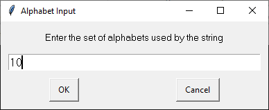
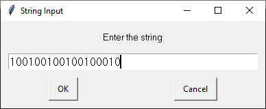

# Interactive DFA
An interactive Deterministic Finite Automaton (DFA) designing tool implemented in Python3.

This tool allows one to dynamically design and draw a DFA which can be saved, loaded, and even tested with the parsing functionality.

# How to use #

Run `src/application.py` and you will be greeted by a blank window with a line at the bottom.

  

### Controls ###
#### State Creation ####
- Right-click anywhere above the line to create a new state. By default it will be labelled as "q0" and will be set as the initial state.

  

- Left-click a state to select it and drag the mouse to move it around.
- Use the Up and Down arrow keys to increase and decrease the index of the state, respectively.

#### Edge Creation ####
- To create an edge, select the state that you want the edge to go **out** from. Move the mouse pointer to be on top of the state you want the edge to connect to and press an `ASCII` symbol on your keyboard to create an edge to this state on the pressed symbol.

In this example, I make a transition from `q0` to `q1` on the symbol `1`.

  

  

  

- To delete an edge, follow the same process as creating an edge and press the same `ASCII` symbol to remove that edge.
- To bend an edge, select **from** state of the edge and mouse over to the **to** state of the edge, and use the scroll wheel to bend the edge. You cannot bend looping edges (edges that loop to the same state).

#### Ctrl-Commands ####
Thes commands can be modified in the `src/settings.py` class. The ones listed here are the default settings.
- `Ctrl-a` - Toggle accepting for the selected state.
- `Ctrl-q` - Mark the selected state as the initial state.
- `Ctrl-s` - Save the DFA. This will display a save prompt which will allow you to save the DFA model to a `.idfa` file.
- `Ctrl-d` - Load a DFA. This will display a load prompt which will load a `.idfa` file. 
- `Ctrl-x` - Quit the program. All unsaved progress will be lost.
- `Ctrl-w` - Parse a string. This will display input prompts as follows:

For the following prompt, enter the set of alphabets that the DFA uses as this is used to ensure the DFA is valid. The input format should just be the string of alphabets with no seperators (commas, spaces, etc.). Repetition of alphabets is allowed, but will be ignored.

  

For the following prompt, enter the string that the DFA should parse. The string must only contain characters from the alphabet that was entered in the previous prompt. 

  

This is a sample DFA parsing the string "1000011110101001100" with alphabet "10":

  

